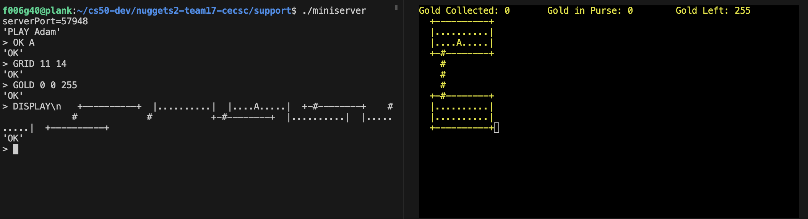

## Current state of development
The display method works if correct size is provided as well as expected format of DISPLAY string.
Currently, the terminal is in _cbreak_ mode but there is no user feedback sent to server.

### Current expected behaviour

## Done
### CURSES
* Intialized
* display board
### messages
* GOLD message
* GRID message
* DISPLAY message (? may need debugging)

## Not tested
* QUIT message
* ERROR message

## TO-DO
* getch() for user response
* debug existing code